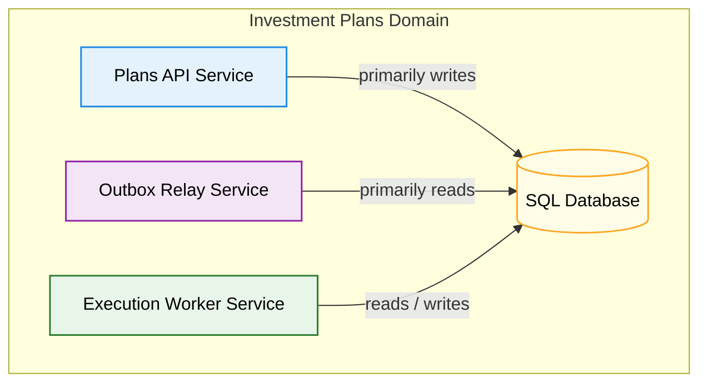
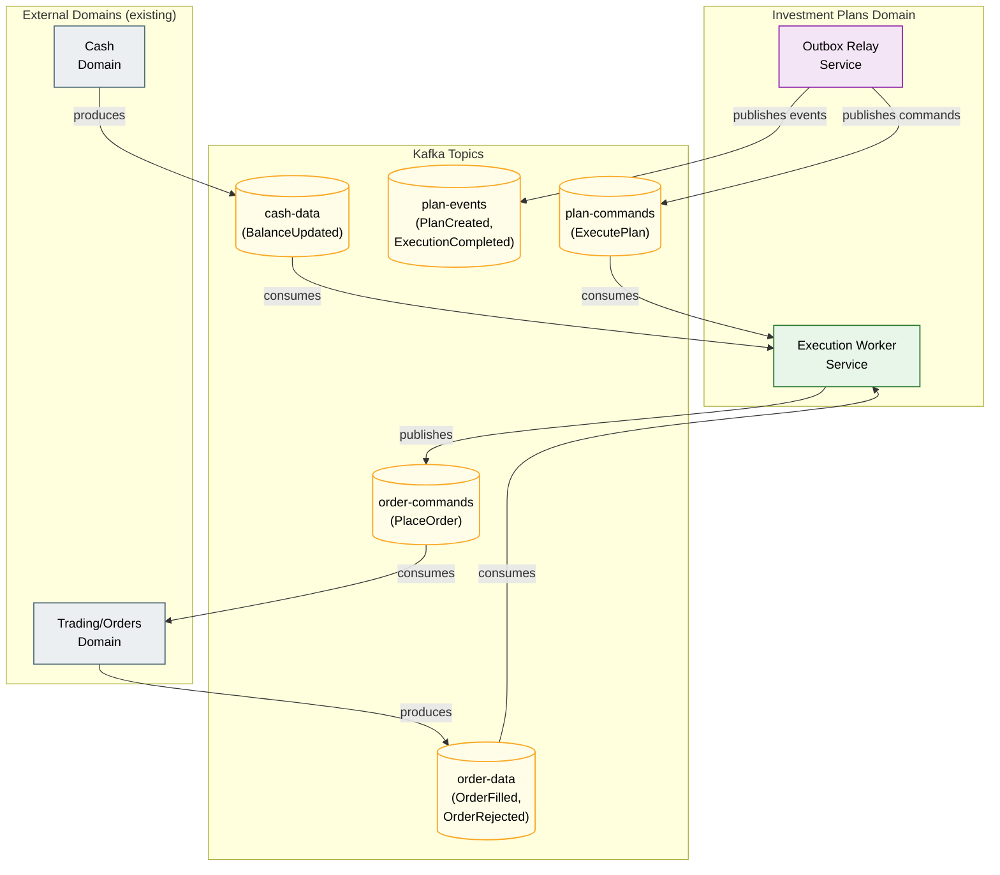
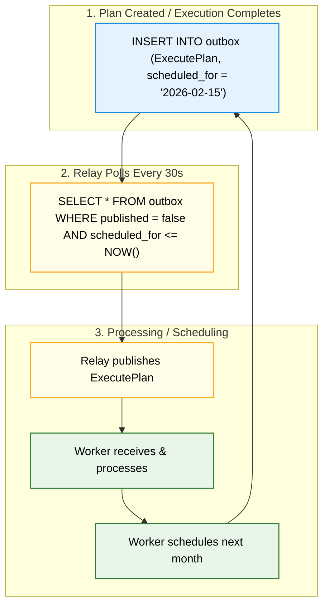
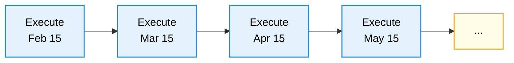
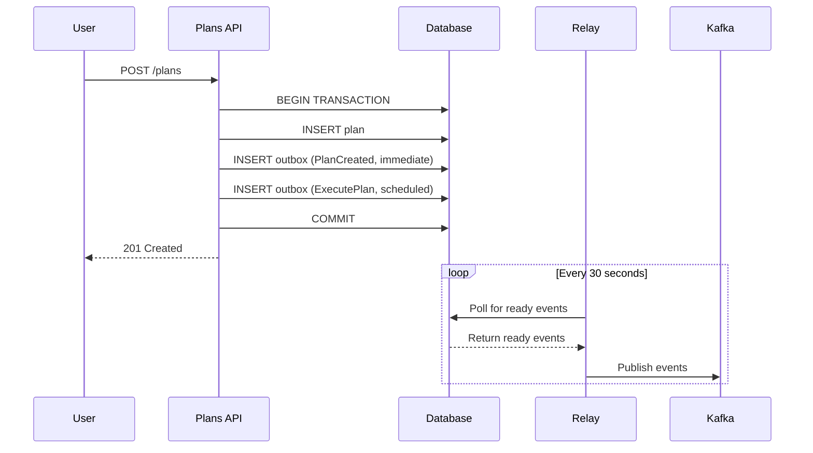
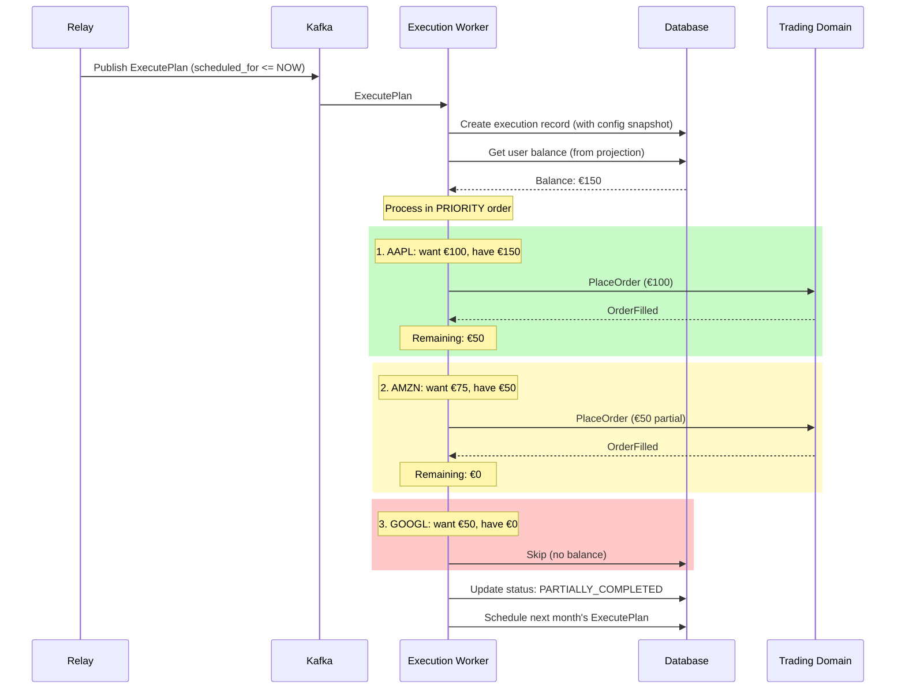
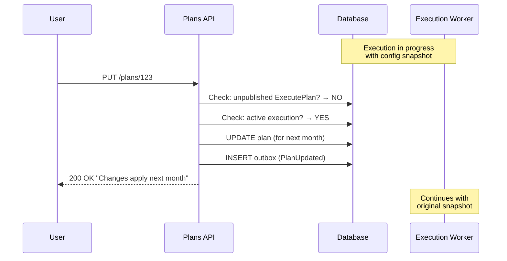
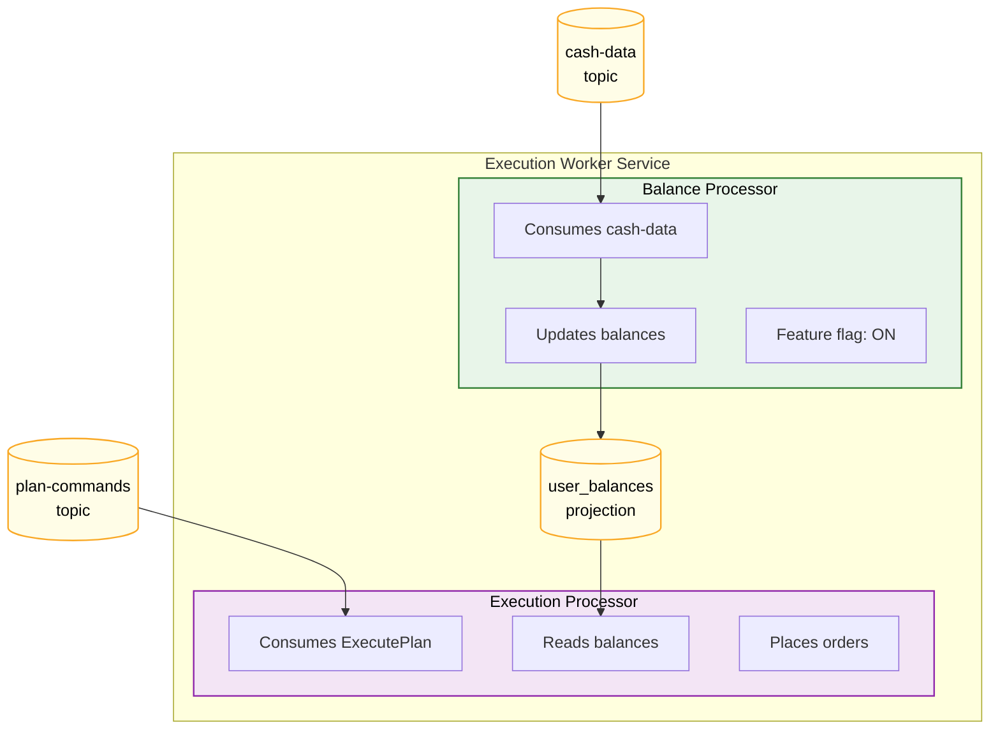

# Investment Plans - Architecture Document

---

## 1. Executive Summary

| Aspect                  | Details                                                                                                                                                                 |
| ----------------------- | ----------------------------------------------------------------------------------------------------------------------------------------------------------------------- |
| **Problem**             | Users forget to invest regularly; want "set and forget"                                                                                                                 |
| **Solution**            | Automated monthly investment plans with fractional shares                                                                                                               |
| **Scale**               | 50K+ plans, ~5K daily executions                                                                                                                                        |
| **Architecture**        | Transactional Outbox + Kafka (no new infrastructure)                                                                                                                    |
| **Key Decisions**       | • Partial success > all-or-nothing (user gets value)<br/>• Priority-based funding (user controls what matters)<br/>• Polling over CDC (simpler ops, acceptable latency) |
| **Critical Dependency** | Trading Domain must support fractional shares                                                                                                                           |
| **Timeline**            | Cannot estimate until team allocated; effort = Large                                                                                                                    |
| **Risk**                | Medium — depends on Trading Domain and open questions                                                                                                                   |
| **Regulatory**          | GDPR compliant; MiFID II 7-year retention                                                                                                                               |
| **Next Step**           | Resolve Q1-Q2 (fractional shares, partial amounts)                                                                                                                      |

### What We're Building

Investment Plans is a new feature enabling users to automate recurring investments through the mobile app. Users define a plan specifying which assets to purchase and how much to invest in each, select a day of the month for execution, and the system automatically places orders on their behalf using their available cash balance.

A typical plan might look like:

- **Monthly Tech Portfolio**: Execute on the 15th of each month
  - Apple (AAPL): €100
  - Amazon (AMZN): €50
  - Google (GOOGL): €50

The system will manage the complete lifecycle: plan creation, scheduled execution, order placement via the existing Trading domain, and execution status reporting.

### Why We're Building It

**User Value:**

- "Set and forget" investing removes friction and manual effort
- Enables consistent, disciplined investment behavior
- Supports diversification across multiple instruments in a single plan

**Business Value:**

- Increases recurring engagement and predictable trade volume
- Reduces barriers for long-term investors
- Strengthens user retention through automated, ongoing interactions

### Key Constraints

| Constraint               | Description                                                                                                       |
| ------------------------ | ----------------------------------------------------------------------------------------------------------------- |
| **Scale**                | Tens of thousands of active plans; executions distributed across the month with peaks on popular days (1st, 15th) |
| **Integration**          | Must integrate with existing Trading/Orders and Cash domains via Kafka; no synchronous APIs available             |
| **Architecture Pattern** | CQRS with event sourcing; all service-to-service communication via Kafka                                          |
| **Execution Window**     | Plans execute "on the configured day" with best-effort timing; no sub-hour precision required                     |
| **Funding**              | Orders funded from user's available cash balance; Cash domain handles allocation during order execution           |

### Architectural Approach (Summary)

We propose a **Transactional Outbox pattern with polling-based relay** for reliable event delivery and scheduled execution:

1. **Plans API Service** handles user interactions (create, update, view plans)
2. **Outbox Table** stores both immediate events and scheduled execution commands within the same database transaction as plan changes
3. **Outbox Relay** polls for ready events and publishes to Kafka (handles both immediate and scheduled events)
4. **Execution Worker** consumes execution commands, places orders via Trading domain, and tracks results

This approach ensures:

- **No dual-write problem** — plan state and events are committed atomically
- **Reliable scheduling** — execution events wait in the outbox until their scheduled date
- **Exactly-once execution** — idempotency keys prevent duplicate order placement
- **Operational simplicity** — single polling mechanism, no CDC infrastructure required for MVP

### Document Structure

| Section                         | Content                                                        |
| ------------------------------- | -------------------------------------------------------------- |
| §2 Architecture Overview        | Components, data flow, sequence diagrams                       |
| §3 Key Design Decisions         | What we chose, what we rejected, and why                       |
| §4 Trade-offs                   | What we're optimizing for vs. sacrificing                      |
| §5 Risks & Mitigations          | What could go wrong and how we handle it                       |
| §6 Assumptions & Open Questions | Dependencies on Product/Engineering clarification              |
| §7 Non-Functional Requirements  | Scalability, reliability, observability targets                |
| §8 MVP Scope & Post-MVP         | Phased delivery approach                                       |
| §9 Delivery Plan                | Development, testing, and rollout strategy                     |
| Appendices A-F                  | Code, SLOs, scalability, fallbacks, design rationale, AI usage |

---

## 2. Architecture Overview

### 2.1 Investment Plans Services

We introduce three new services within the Investment Plans domain:



| Service                      | Responsibility                                                                                                                                                                              |
| ---------------------------- | ------------------------------------------------------------------------------------------------------------------------------------------------------------------------------------------- |
| **Plans API Service**        | Exposes HTTP API for mobile app; handles plan CRUD operations; writes plan changes and outbox events in single atomic transaction                                                           |
| **Outbox Relay Service**     | Polls outbox table every 30 seconds; publishes ready events (immediate and scheduled) to Kafka; ensures reliable event delivery                                                             |
| **Execution Worker Service** | Two consumers: (1) Consumes `cash-data` to maintain balance projection; (2) Consumes `ExecutePlan` commands, orchestrates order placement, tracks execution state, schedules next execution |

### 2.2 HTTP API for Create/View Plans

The Plans API Service exposes the following REST endpoints:

| Method   | Endpoint                        | Description                  |
| -------- | ------------------------------- | ---------------------------- |
| `POST`   | `/api/v1/plans`                 | Create a new investment plan |
| `GET`    | `/api/v1/plans`                 | List user's plans            |
| `GET`    | `/api/v1/plans/{id}`            | Get plan details             |
| `PUT`    | `/api/v1/plans/{id}`            | Update plan configuration    |
| `DELETE` | `/api/v1/plans/{id}`            | Delete (soft) a plan         |
| `POST`   | `/api/v1/plans/{id}/pause`      | Pause plan execution         |
| `POST`   | `/api/v1/plans/{id}/resume`     | Resume paused plan           |
| `GET`    | `/api/v1/plans/{id}/executions` | Get execution history        |
| `GET`    | `/api/v1/executions/{id}`       | Get execution details        |

### 2.3 Integration with Existing Domains via Kafka

**Alignment with Existing Architecture:**

- All service-to-service communication uses Kafka (no synchronous inter-service calls)
- We follow CQRS with event sourcing: services receive commands, validate against current state, and emit events
- Cash allocation during order execution is handled by the existing Cash Domain — we do not design this



**Topics We Produce:**

| Topic            | Event/Command        | Description                                             |
| ---------------- | -------------------- | ------------------------------------------------------- |
| `plan-events`    | `PlanCreated`        | Emitted when user creates a plan                        |
| `plan-events`    | `PlanUpdated`        | Emitted when user modifies a plan                       |
| `plan-events`    | `PlanDeleted`        | Emitted when user deletes a plan                        |
| `plan-events`    | `ExecutionStarted`   | Emitted when execution begins                           |
| `plan-events`    | `ExecutionCompleted` | Emitted when execution finishes (success or partial)    |
| `plan-commands`  | `ExecutePlan`        | Command to trigger plan execution (internal, scheduled) |
| `order-commands` | `PlaceOrder`         | Command to Trading domain to place an order             |

**Topics We Consume:**

| Topic           | Event/Command    | How We Use It                                                                      |
| --------------- | ---------------- | ---------------------------------------------------------------------------------- |
| `plan-commands` | `ExecutePlan`    | Execution Worker receives and processes                                            |
| `order-data`    | `OrderFilled`    | Update execution_order status to FILLED                                            |
| `order-data`    | `OrderRejected`  | Update execution_order status to REJECTED, record reason                           |
| `cash-data`     | `BalanceUpdated` | Maintain local projection of user's available balance for pre-execution validation |

**CQRS Pattern in Our Services:**

```mermaid
flowchart LR

%% ====================
%% 1. Receive Command
%% ====================
subgraph RCV["1. Receive Command"]
    CMD[ExecutePlan command]
end

%% ==============
%% 2. Validation
%% ==============
subgraph VAL["2. Validation"]
    V1[Idempotency check]
    V2[Balance check]
    V3[Plan is ACTIVE]
end

%% =================
%% 3. Emit Messages
%% =================
subgraph EMIT["3. Emit Events / Commands"]
    E1[ExecutionStarted event]
    E2[PlaceOrder command per asset]
    E3[ExecutionCompleted event]
end

%% =====
%% Flow
%% =====
CMD --> V1 --> V2 --> V3 --> E1 --> E2 --> E3

%% =========
%% Styling
%% =========
style CMD fill:#E3F2FD,stroke:#1E88E5,stroke-width:1.5px,color:#000

style V1 fill:#E8F5E9,stroke:#2E7D32,stroke-width:1.5px,color:#000
style V2 fill:#E8F5E9,stroke:#2E7D32,stroke-width:1.5px,color:#000
style V3 fill:#E8F5E9,stroke:#2E7D32,stroke-width:1.5px,color:#000

style E1 fill:#FFFDE7,stroke:#F9A825,stroke-width:1.5px,color:#000
style E2 fill:#FFFDE7,stroke:#F9A825,stroke-width:1.5px,color:#000
style E3 fill:#FFFDE7,stroke:#F9A825,stroke-width:1.5px,color:#000

```



### 2.4 Scheduling and Execution of Plans

**Scheduling Mechanism: Transactional Outbox with Polling**

Instead of a dedicated scheduler service, we use the outbox table with a `scheduled_for` column:

**Command vs Event Distinction (CQRS Discipline):**

> We treat `ExecutePlan` as a **time-delayed command**, not a domain event. It represents an instruction to the system ("execute this plan at time T"), not a fact that already happened. In contrast, `PlanCreated`, `ExecutionCompleted` are true **events** — they describe facts.
>
> This distinction matters: commands can fail or be rejected; events are immutable facts.



**Self-perpetuating execution chain:**



**Key Scheduling Properties:**

- **Atomic scheduling**: Execution event created in same transaction as plan/execution update
- **Config snapshot**: Plan configuration captured in event payload at scheduling time
- **Idempotency**: Execution ID format `{plan_id}_{year}_{month}` prevents duplicate executions

### 2.5 Key Data Flows

#### Flow 1: Plan Creation



#### Flow 2: Plan Execution



**Execution Logic:**

1. Get user's available balance from `cash-data` projection
2. Iterate through assets **in priority order** (first = most important)
3. For each asset: invest `min(requested_amount, remaining_balance)`
4. If remaining balance > 0, continue to next asset
5. If remaining balance = 0, skip all remaining assets
6. Final status: `COMPLETED` (all fully funded), `PARTIALLY_COMPLETED` (some partial/skipped), or `SKIPPED_INSUFFICIENT_FUNDS` (none funded)

#### Flow 3: Plan Update During Execution



> **Note:** If update happens BEFORE relay publishes (unpublished event exists), the outbox payload is updated and changes apply to THIS execution.

---

## 3. Key Design Decisions

### Decision 1: Architectural Approach

We evaluated three distinct architectural approaches:

| Approach                                   | Description                                                                                                                                                                                              |
| ------------------------------------------ | -------------------------------------------------------------------------------------------------------------------------------------------------------------------------------------------------------- |
| **Saga Orchestration with Cron Scheduler** | Dedicated scheduler service runs daily, identifies due plans, triggers executions; Saga state machine tracks multi-step execution with explicit compensation                                             |
| **Transactional Outbox with Polling**      | Events (including scheduled executions) stored in DB outbox table within same transaction as business data; `scheduled_for` column enables future execution; relay polls and publishes when time arrives |
| **Distributed Partitioned Workers**        | Workers claim executions via DB locks; partitioned by user_id for horizontal scaling; each worker polls its assigned partitions                                                                          |

**Comparison:**

| Criteria             | Saga/Cron        | Outbox+Polling  | Partitioned Workers |
| -------------------- | ---------------- | --------------- | ------------------- |
| Complexity           | Medium           | **Low ✓**       | High                |
| Scalability          | Limited          | **Good ✓**      | Excellent           |
| Fault Tolerance      | High             | **High ✓**      | Medium              |
| Debuggability        | Excellent        | **Good ✓**      | Good                |
| Kafka/CQRS Alignment | Good             | **Excellent ✓** | Moderate            |
| Operational Cost     | Medium           | **Low ✓**       | High                |
| Scheduling           | Separate service | **Built-in ✓**  | DB polling          |
| Config Snapshot      | Explicit         | **Built-in ✓**  | Must implement      |

| Aspect       | Detail                                                                                                                                                                                                                                                                                                                                                                                                                        |
| ------------ | ----------------------------------------------------------------------------------------------------------------------------------------------------------------------------------------------------------------------------------------------------------------------------------------------------------------------------------------------------------------------------------------------------------------------------- |
| **Chose**    | Transactional Outbox with Polling                                                                                                                                                                                                                                                                                                                                                                                             |
| **Rejected** | Saga/Cron Scheduler, Distributed Partitioned Workers                                                                                                                                                                                                                                                                                                                                                                          |
| **Why**      | (1) Atomic scheduling — execution event created in same transaction as plan, eliminating dual-write problem. (2) Single mechanism for immediate events and scheduled executions. (3) Config snapshot naturally embedded in event payload. (4) No dedicated scheduler to make highly available. (5) Scale (tens of thousands) doesn't require distributed worker complexity. (6) Aligns with existing Kafka/CQRS architecture. |

**Why Not Alternative Patterns?**

| Alternative                    | Why Not                                                                                                       | When It Would Make Sense                                                                                   |
| ------------------------------ | ------------------------------------------------------------------------------------------------------------- | ---------------------------------------------------------------------------------------------------------- |
| **Event-Driven Saga**          | Overly complex coordination for our scale; added complexity without proportional benefit                      | If we needed cross-domain transactions with rollback (e.g., reserve cash → place order → release if fails) |
| **Quartz/Cron Scheduler**      | Introduces new scheduling infrastructure; doesn't align with event-driven architecture; SPOF without HA setup | If we needed sub-minute precision or complex recurrence patterns (every 2nd Tuesday)                       |
| **Redis Sorted Sets (Timers)** | Adds operational complexity; loses ACID guarantees; another system to manage                                  | If we needed millions of timers with sub-second precision                                                  |
| **Kafka Delayed Messages**     | Kafka doesn't natively support delayed delivery; would need custom solution                                   | If organization already had delayed message infrastructure                                                 |

### Decision 2: Polling-Based Relay over CDC (Debezium)

| Aspect       | Detail                                                                                                                                                                                                                              |
| ------------ | ----------------------------------------------------------------------------------------------------------------------------------------------------------------------------------------------------------------------------------- |
| **Chose**    | Simple polling relay (every 30 seconds)                                                                                                                                                                                             |
| **Rejected** | Change Data Capture with Debezium                                                                                                                                                                                                   |
| **Why**      | Simpler operations — no Kafka Connect cluster, no schema registry, no CDC-specific monitoring. 30-second latency is acceptable for plan events and scheduled executions. Can upgrade to CDC later if real-time requirements emerge. |

### Decision 3: Configuration Snapshot in Event Payload

| Aspect       | Detail                                                                                                                                                                 |
| ------------ | ---------------------------------------------------------------------------------------------------------------------------------------------------------------------- |
| **Chose**    | Capture full plan configuration in `ExecutePlan` event payload at scheduling time                                                                                      |
| **Rejected** | Worker reads current plan config at execution time                                                                                                                     |
| **Why**      | Prevents race conditions with plan modifications. Running execution uses snapshotted config; changes apply next month. Clear audit trail of exactly what was executed. |

### Decision 4: Idempotency Key Strategy

| Aspect       | Detail                                                                                                                |
| ------------ | --------------------------------------------------------------------------------------------------------------------- |
| **Chose**    | Consistent composite key: `{plan_id}_{year}_{month}_{attempt}` (attempt starts at 0)                                  |
| **Rejected** | UUID-based idempotency; separate success tracking table                                                               |
| **Why**      | Simple, consistent format. First execution = attempt 0. Retries increment. Trading domain deduplicates using our key. |

**Retry Policy:** Max 3 attempts (0,1,2). Backoff: 5min → 30min → 2h. After 3 failures: FAILED, notify user.

### Decision 5: Partial Execution Handling

| Aspect       | Detail                                                                                                                                                                                      |
| ------------ | ------------------------------------------------------------------------------------------------------------------------------------------------------------------------------------------- |
| **Chose**    | Allow partial success — completed orders stand, failed orders are recorded                                                                                                                  |
| **Rejected** | All-or-nothing with compensation/rollback                                                                                                                                                   |
| **Why**      | Compensation is complex in financial systems (unwinding filled orders is risky). User benefits from successful investments even if some fail. Clear reporting of what succeeded vs. failed. |

**Execution Order State Model:**

| State       | Meaning                                                  | Transition From |
| ----------- | -------------------------------------------------------- | --------------- |
| `PENDING`   | Order command sent to Trading Domain                     | Initial         |
| `PLACED`    | Order acknowledged by Trading Domain                     | PENDING         |
| `FILLED`    | Order executed, shares purchased                         | PLACED          |
| `REJECTED`  | Trading Domain explicitly rejected (e.g., market closed) | PLACED          |
| `FAILED`    | Error during placement (e.g., network failure)           | PENDING         |
| `TIMED_OUT` | No confirmation received within SLA (60s)                | PLACED          |
| `SKIPPED`   | Not attempted (insufficient funds, no balance remaining) | Initial         |

**Timeout Handling:**

- Orders in `PLACED` state with no `FILLED`/`REJECTED` response within 60 seconds are marked `TIMED_OUT`
- Timed-out orders are **not retried** in the same execution (could cause duplicates if original order actually succeeded)
- Next month's execution will naturally retry via new `ExecutePlan` command
- User notified: "Order confirmation not received for AAPL — please check your portfolio"

### Decision 6: Plan Modification During Execution

| Aspect       | Detail                                                                                                                                                                                |
| ------------ | ------------------------------------------------------------------------------------------------------------------------------------------------------------------------------------- |
| **Chose**    | Allow modification; changes apply to next execution (current uses snapshot)                                                                                                           |
| **Rejected** | Block modifications with hard lock during execution                                                                                                                                   |
| **Why**      | Better UX — user isn't blocked from managing their plan. No ambiguity about which config applies. If outbox event not yet published, payload is updated so changes apply immediately. |

### Decision 7: Insufficient Balance Handling

**Context:** Users invest fixed EUR amounts per asset (e.g., "€100 in AAPL"). Since share prices typically exceed these amounts (AAPL ≈ €170/share), the system operates on **fractional shares** — this is a requirement, not optional.

**Strategies Considered:**

| Strategy                                     | Description                                                                | Pros                                         | Cons                                                          |
| -------------------------------------------- | -------------------------------------------------------------------------- | -------------------------------------------- | ------------------------------------------------------------- |
| **A. Priority with partial** ⭐              | Invest in priority order; partially fund next asset with remaining balance | Maximizes investment; respects user priority | User may get unexpected partial amounts                       |
| **B. Skip to next affordable**               | Skip assets that can't be fully funded; continue to cheaper assets         | Full amounts only                            | Violates priority (lower-priority asset funded before higher) |
| **C. Full amounts only, stop at first skip** | Fund only assets that fit fully; stop when one doesn't fit                 | Simple; predictable                          | Money left uninvested                                         |
| **D. All or nothing**                        | If total exceeds balance, skip entire execution                            | No partial state                             | User gets nothing; poor UX                                    |

| Aspect       | Detail                                                                                                                                                                                          |
| ------------ | ----------------------------------------------------------------------------------------------------------------------------------------------------------------------------------------------- |
| **Chose**    | **Strategy A: Priority with partial** — Invest in priority order; use remaining balance for partial investment in next priority asset                                                           |
| **Rejected** | Skip to affordable (violates priority), Full amounts only (wastes money), All or nothing (poor UX)                                                                                              |
| **Why**      | User controls priority by ordering assets. Higher-priority assets get funded first. Remaining balance goes to next priority asset (partial). Maximizes investment while respecting user intent. |

**Assumption:** Trading Domain supports fractional share orders (critical — feature doesn't work without this).

**Open Questions for Product:**

- Is it acceptable to invest less than configured amount when balance is insufficient? (see Q2)
- Should we notify users when an asset is partially funded, or only when completely skipped?

### Decision 8: Balance Data Strategy

| Aspect       | Detail                                                                                                                                                                                                                                                                                                                                        |
| ------------ | --------------------------------------------------------------------------------------------------------------------------------------------------------------------------------------------------------------------------------------------------------------------------------------------------------------------------------------------- |
| **Chose**    | Local DB projection from `cash-data` topic; pre-validate before execution; handle rejections gracefully                                                                                                                                                                                                                                       |
| **Rejected** | (a) Redis cache, (b) Synchronous API call to Cash Domain, (c) Kafka request-reply, (d) Separate projection service                                                                                                                                                                                                                            |
| **Why**      | Local DB is fast enough for batch execution (not real-time). Adding Redis increases operational complexity without significant benefit. Sync API violates Kafka-only architecture. Separate service is overkill for MVP scale. Our balance check is **best-effort pre-validation** — Cash Domain is the source of truth and may still reject. |

**Database Choice:** Use whatever relational DB the organization runs. Outbox pattern requires ACID transactions; any SQL database works (PostgreSQL, MySQL, etc.). At 5K executions/day, we don't need column-oriented (ClickHouse) or specialized time-series DBs.

**Who Maintains the Projection?**

The **Execution Worker** consumes `cash-data` topic and maintains the `user_balances` projection table. This keeps architecture simple for MVP (no separate projection service), but we design for future separation.



**Why Combined Service for MVP?**

| Benefit                | Explanation                                  |
| ---------------------- | -------------------------------------------- |
| **Simpler ops**        | One service to deploy, monitor, scale        |
| **No network latency** | Balance data in same process                 |
| **Faster development** | Single codebase, easier debugging            |
| **Sufficient scale**   | 50K users, 5K daily executions is manageable |

**When to Split (Post-MVP Triggers):**

| Trigger                                  | Action                    |
| ---------------------------------------- | ------------------------- |
| Balance updates > 100/sec                | Consider separating       |
| Executions delayed by balance processing | Split to isolate          |
| Different teams own each                 | Split for org alignment   |
| Balance projection needed elsewhere      | Extract to shared service |

### Decision 9: Market Hours & Day 31 Handling

**Market Hours:**

Executions may fall on weekends or market holidays when orders cannot be placed.

| Option                                  | Description                                               | Trade-off                                |
| --------------------------------------- | --------------------------------------------------------- | ---------------------------------------- |
| **A. Execute anyway** ⭐                | Place orders; Trading Domain rejects with `MARKET_CLOSED` | Simple; handled by existing failure path |
| **B. Skip to next business day**        | Delay execution until market open                         | Complex scheduling; user confusion       |
| **C. Execute on previous business day** | Pre-emptive execution                                     | Changes user expectation                 |

| Aspect       | Detail                                                                                                                                                                                |
| ------------ | ------------------------------------------------------------------------------------------------------------------------------------------------------------------------------------- |
| **Chose**    | **Option A: Execute anyway** — let Trading Domain reject, handle as order failure                                                                                                     |
| **Rejected** | Smart scheduling (adds complexity without proportional benefit for MVP)                                                                                                               |
| **Why**      | Simpler implementation. Failure is handled by existing partial success logic. User sees "AAPL order rejected: market closed" in execution details. Post-MVP can add smart scheduling. |

---

## 4. Trade-offs

### What We're Optimizing For vs. Sacrificing

| Optimizing For       | Sacrificing         | Why This Trade-off Makes Sense                                                                                                            |
| -------------------- | ------------------- | ----------------------------------------------------------------------------------------------------------------------------------------- |
| **Simplicity**       | Maximum scalability | Tens of thousands of plans doesn't require distributed worker complexity. Simpler system = fewer bugs, easier debugging, faster delivery. |
| **Reliability**      | Real-time execution | 30-second polling latency is acceptable for monthly executions. Guaranteed delivery matters more than millisecond precision.              |
| **User experience**  | Perfect consistency | Allowing partial success and modifications means users aren't blocked. Some edge cases require user awareness.                            |
| **Operational ease** | Cutting-edge tech   | Polling over CDC means no Debezium expertise. Local DB over Redis means one less system.                                                  |
| **Auditability**     | Storage efficiency  | Storing config snapshots in events uses more storage but provides complete audit trail.                                                   |

### Trade-off Details

| #     | Chose                                 | Over                               | Gain                                                                | Give Up                                                          | Why Acceptable                                                       |
| ----- | ------------------------------------- | ---------------------------------- | ------------------------------------------------------------------- | ---------------------------------------------------------------- | -------------------------------------------------------------------- |
| **1** | Single Outbox Relay + Workers         | Distributed Partitioned Workers    | Simpler deployment, easier debugging, fewer failure modes           | Horizontal scaling >100K, sub-second precision, geo-distribution | Current scale well within capacity. Can evolve if 10x.               |
| **2** | Polling (30s)                         | CDC/Debezium (sub-second)          | No CDC infra, simpler ops, no schema registry                       | Real-time streaming, sub-second latency                          | Monthly execution. 00:00:00 vs 00:00:30 is irrelevant to users.      |
| **3** | Partial success + allow modifications | All-or-nothing + locks             | User gets value even when some fail, not blocked from managing plan | Simple success/fail status, all-orders-or-none guarantee         | Users prefer partial investment. Clear communication helps.          |
| **4** | Local DB for balance projection       | Redis cache                        | Single DB, ACID guarantees, simpler backup, team knows it           | Microsecond latency, memory-speed performance                    | Batch execution, not user requests. <10ms is fine.                   |
| **5** | Config snapshot in event              | Reference plan ID, read at runtime | Complete audit trail, immune to modifications, trivial debugging    | Storage efficiency, normalized data                              | Configs are small (KB). Storage is cheap. Fintech needs audit trail. |

### Trade-offs Summary

| We Optimize For    | We Sacrifice                   |
| ------------------ | ------------------------------ |
| ✓ Simplicity       | Scalability beyond 100K plans  |
| ✓ Reliability      | Sub-second execution precision |
| ✓ User experience  | All-or-nothing consistency     |
| ✓ Operational ease | Cutting-edge performance       |
| ✓ Auditability     | Storage efficiency             |
| ✓ Time to market   | Feature completeness           |

> **Principle:** "Make it work reliably first, optimize later if needed"

---

## 5. Risks & Mitigations

| Risk                                            | Likelihood | Impact   | Mitigation                                                                                                                        |
| ----------------------------------------------- | ---------- | -------- | --------------------------------------------------------------------------------------------------------------------------------- |
| **Outbox Relay becomes bottleneck**             | Low        | High     | Relay is stateless — can run multiple instances with `FOR UPDATE SKIP LOCKED`. Monitor queue depth; scale horizontally if needed. |
| **Outbox table grows unbounded**                | Medium     | Medium   | Archive published events after 7 days. Partition table by `created_at`. Monitor table size.                                       |
| **Duplicate executions**                        | Low        | High     | Idempotency keys (`plan_year_month`) prevent duplicates. Unique constraint on execution ID. Trading domain deduplicates orders.   |
| **Trading Domain unavailable during execution** | Medium     | High     | Retry with exponential backoff (3 attempts over 2 hours). Mark as FAILED after exhaustion. Alert ops. User notified.              |
| **Stale balance projection causes rejections**  | Medium     | Low      | Balance check is best-effort pre-validation. System handles rejections gracefully. User notified of actual failures.              |
| **Execution takes longer than expected**        | Low        | Medium   | Timeout per order (30s). Mark timed-out orders as FAILED. Continue with remaining orders. Monitor execution duration.             |
| **Plan modified while outbox event in flight**  | Low        | Low      | Snapshot in event payload is immutable. Modifications apply next month. Clear user messaging.                                     |
| **Kafka unavailable**                           | Low        | High     | Outbox pattern provides durability — events remain in DB. Relay retries when Kafka recovers. No data loss.                        |
| **Database failure**                            | Low        | Critical | Standard DB HA (primary + replica). Point-in-time recovery. RTO < 30 minutes.                                                     |

### Risk Response Strategy

| Severity                             | Risk                | Response                              |
| ------------------------------------ | ------------------- | ------------------------------------- |
| **CRITICAL** (Data Loss / Financial) | Database failure    | HA setup, automated failover, backups |
| **CRITICAL**                         | Duplicate orders    | Idempotency at every layer            |
| **HIGH** (Service Disruption)        | Kafka down          | Outbox durability, relay retry        |
| **HIGH**                             | Trading unavailable | Retry policy, graceful degradation    |
| **MEDIUM** (Degraded Experience)     | Stale balance       | Handle rejection, notify user         |
| **MEDIUM**                           | Slow execution      | Timeouts, partial completion          |
| **LOW** (Minor Inconvenience)        | Polling delay       | Acceptable for use case               |

### Disaster Recovery Considerations

As a fintech system handling real money, disaster recovery is critical:

**Regional Failure:**

- Database: Cross-region read replica with manual failover
- Kafka: Mirror topics to secondary region (if org supports)
- Services: Deploy to secondary region, DNS-based failover

**Data Corruption:**

- Outbox provides event replay capability from any point in time
- Can rebuild projections (balance, execution state) from events
- Immutable execution snapshots enable audit reconstruction

**RTO/RPO Targets:**

| Scenario            | RTO       | RPO                              |
| ------------------- | --------- | -------------------------------- |
| Single node failure | < 5 min   | 0 (HA failover)                  |
| Regional failure    | < 4 hours | < 5 min (async replication)      |
| Data corruption     | < 2 hours | Point-in-time (hourly snapshots) |

**Recovery Procedure:**

1. Identify scope (node/region/corruption)
2. Failover database to replica
3. Replay outbox events from last known good state
4. Verify execution state consistency
5. Resume relay and workers

### Main Failure Scenarios Considered

| Scenario                                               | Behavior                                                                                                                                                                          |
| ------------------------------------------------------ | --------------------------------------------------------------------------------------------------------------------------------------------------------------------------------- |
| **1. Partial Execution Failure** (Trading unavailable) | Successful orders STAND (no rollback), failed marked FAILED. Not retried same execution; user notified.                                                                           |
| **2. Plan Modification During Execution**              | Current uses SNAPSHOT; changes apply NEXT month. If outbox not published yet, payload updated (changes apply now).                                                                |
| **3. Insufficient Balance**                            | Execute in priority order; partial fund if needed; skip when €0. Example (€150; AAPL €100, AMZN €75, GOOGL €50): AAPL €100→full, AMZN €75→€50 partial, GOOGL→skip = €150 invested |

---

## 6. Assumptions & Open Questions

### Assumptions

| #      | Assumption                                                                       | Impact if Wrong                                                                                                                                      |
| ------ | -------------------------------------------------------------------------------- | ---------------------------------------------------------------------------------------------------------------------------------------------------- |
| **A1** | **Trading Domain supports fractional share orders**                              | **CRITICAL — Feature doesn't work without this. Users invest EUR amounts (e.g., €100 in AAPL), and share prices (€170+) exceed investment amounts.** |
| **A2** | **We can place orders for partial amounts (e.g., €50 when plan says €75)**       | **If not, insufficient balance strategy changes — cannot partially fund assets**                                                                     |
| A3     | Trading Domain supports idempotent order placement via client-provided key       | Must implement deduplication ourselves; significantly more complex                                                                                   |
| A4     | `cash-data` topic provides balance updates we can project                        | Need alternative balance source or skip pre-validation                                                                                               |
| A5     | Order confirmations arrive via `order-data` topic within reasonable time (< 60s) | Need longer timeouts or async confirmation handling                                                                                                  |
| A6     | Single currency (EUR) for MVP                                                    | Multi-currency requires FX handling                                                                                                                  |
| A7     | Execution day means "anytime on that day" (no specific hour)                     | Precise timing needs scheduler enhancement                                                                                                           |
| A8     | Partial execution success is acceptable to business                              | All-or-nothing requires compensation logic                                                                                                           |
| A9     | Asset order in plan determines execution priority (first = most important)       | Need alternative prioritization strategy                                                                                                             |
| A10    | Relational database with ACID transactions available                             | Outbox pattern requires atomic writes; adapt to existing DB (PostgreSQL, MySQL, etc.)                                                                |
| A11    | Containerized deployment with auto-scaling available                             | Adjust based on existing infra (K8s, Fargate, Cloud Run, etc.)                                                                                       |
| A12    | Plans execute indefinitely until paused/deleted (no end date)                    | End date feature adds complexity                                                                                                                     |

### Open Questions for Product

| #      | Question                                                                                                                               | Why It Matters                                                                  |
| ------ | -------------------------------------------------------------------------------------------------------------------------------------- | ------------------------------------------------------------------------------- |
| **Q1** | **Can you confirm Trading Domain supports fractional shares?**                                                                         | **Critical assumption — entire feature depends on this**                        |
| **Q2** | **Is it acceptable to invest less than configured amount when balance is insufficient?** (e.g., invest €50 in AMZN when plan says €75) | **Affects insufficient balance strategy — if no, we must skip assets entirely** |
| Q3     | What's the minimum investment amount per asset? (e.g., €1? €10?)                                                                       | Validation rules; very small amounts may not be practical                       |
| Q4     | What's the maximum number of assets per plan?                                                                                          | Affects execution timeout and validation                                        |
| Q5     | Should users be notified before execution (reminder) or only after?                                                                    | Notification system scope                                                       |
| Q6     | What happens on day 31 for months with fewer days?                                                                                     | Execute on last day? Skip? User choice?                                         |
| Q7     | Should paused plans show "next execution" date?                                                                                        | UX decision affecting API response                                              |
| Q8     | Can users reorder assets in their plan? (to change priority)                                                                           | UX for controlling insufficient balance behavior                                |
| Q9     | If balance is insufficient for ALL assets, should we skip execution entirely or notify and wait?                                       | Edge case handling                                                              |

### Open Questions for Engineering

| #       | Question                                                                        | Why It Matters                                           |
| ------- | ------------------------------------------------------------------------------- | -------------------------------------------------------- |
| **Q10** | **Does Trading Domain API accept EUR amounts or share quantities?**             | **Affects order placement implementation**               |
| Q11     | What's the SLA of Trading Domain? (availability, latency p99)                   | Timeout and retry configuration                          |
| Q12     | Does Trading Domain support order cancellation?                                 | Compensation strategy if needed                          |
| Q13     | Is Debezium available if we need CDC later?                                     | Future scalability path                                  |
| Q14     | What's the partition strategy for `order-data` topic?                           | Consumer group design                                    |
| Q15     | Are there existing patterns for outbox/relay in the codebase?                   | Reuse vs. build                                          |
| Q16     | Are there existing circuit breaker/rate limiter patterns?                       | Reuse for Trading/Cash Domain calls                      |
| Q17     | What's the deployment model? (K8s, Fargate, Cloud Run, EC2+ASG)                 | Affects scaling and ops approach                         |
| Q18     | What's the existing observability stack? (metrics, logging, tracing)            | Integrate rather than introduce new tools                |
| Q19     | What database is used for other domains? (PostgreSQL, MySQL, DynamoDB, MongoDB) | Use existing DB; outbox pattern needs ACID or equivalent |
| Q20     | What's the `cash-data` topic structure? (event schema, user_id location)        | Need to understand payload to build balance projection   |

---

## 7. Non-Functional Requirements

### Scalability

| Metric                | Target     | Notes                              |
| --------------------- | ---------- | ---------------------------------- |
| Active plans          | 50,000+    | Current scale with growth headroom |
| Daily executions      | 5,000 peak | Assumes popular days (1st, 15th)   |
| Orders per execution  | 10 max     | Reasonable diversification limit   |
| API requests/sec      | 100 RPS    | Plan CRUD operations               |
| Concurrent executions | 100        | Parallel order processing          |

### Reliability

| Metric                 | Target        | Notes                                               |
| ---------------------- | ------------- | --------------------------------------------------- |
| Plans API availability | 99.9%         | User-facing service                                 |
| Execution success rate | 99%+          | Excluding user-caused failures (insufficient funds) |
| Data durability        | No data loss  | Outbox pattern + DB transaction guarantees          |
| Execution delivery     | At-least-once | Idempotency ensures exactly-once effect             |

### Performance

| Operation        | Target (p99) | Notes                         |
| ---------------- | ------------ | ----------------------------- |
| Create plan      | < 200ms      | Sync API response             |
| Get plans        | < 100ms      | Read from local DB            |
| Execute plan     | < 60s        | Including order confirmations |
| Polling interval | 30s          | Relay frequency               |

### Observability

| Category     | Requirements                                                    | Examples (adapt to existing stack)    |
| ------------ | --------------------------------------------------------------- | ------------------------------------- |
| **Metrics**  | Execution counts, success rate, latency histograms, queue depth | Prometheus, Datadog, CloudWatch       |
| **Logging**  | Structured JSON with trace_id, plan_id, execution_id            | ELK, Splunk, CloudWatch Logs          |
| **Tracing**  | End-to-end execution flow                                       | OpenTelemetry, Jaeger, X-Ray          |
| **Alerting** | Failures > 5%, queue depth > 1000, relay lag > 5min             | PagerDuty, OpsGenie, existing on-call |

**Note:** Integrate with existing observability stack rather than introducing new tools.

### Key Alerts

| Alert                       | Condition                            | Severity |
| --------------------------- | ------------------------------------ | -------- |
| Execution failure rate high | > 5% failures in 15 min              | Critical |
| Outbox queue growing        | > 1000 unpublished events for 30 min | Warning  |
| Relay not running           | No events published in 5 min         | Critical |
| Execution duration high     | p99 > 5 min                          | Warning  |

### Business-Focused Metrics

Beyond technical health, these metrics measure **user and revenue impact**:

| Metric                               | What It Measures                                        | Why It Matters                                   |
| ------------------------------------ | ------------------------------------------------------- | ------------------------------------------------ |
| `executions.partial_completion_rate` | % of executions with at least one skipped/partial asset | High rate → users not getting full value         |
| `executions.uninvested_balance_avg`  | Average EUR left uninvested per execution               | High value → balance issues or priority problems |
| `executions.peak_day_failure_rate`   | Failure rate on 1st/15th of month                       | Peak days are high-value; failures hurt most     |
| `plans.active_to_paused_ratio`       | Ratio of active vs paused plans                         | Declining ratio → user disengagement             |
| `plans.avg_assets_per_plan`          | Average number of assets per plan                       | Diversification indicator                        |
| `orders.partial_funding_rate`        | % of orders that were partially funded                  | High rate → users consistently underfunded       |

These metrics enable product decisions: e.g., if `uninvested_balance_avg` is high, consider implementing "invest remainder in lowest-priority asset" feature.

### Data Retention & GDPR Compliance

As a European fintech, we must comply with MiFID II and GDPR:

**Regulatory Retention (MiFID II):**
| Data | Retention |
|------|-----------|
| Execution records | 7 years (required for audit) |
| Order history | 7 years |
| Plan configurations at execution time | 7 years (via snapshots) |

**Operational Retention:**
| Data | Retention |
|------|-----------|
| Active plan data | While plan is active |
| Deleted plan data | 2 years after soft deletion |
| Outbox events | 30 days (archive after publishing) |

**GDPR - Right to Erasure:**

- User requests deletion → soft delete plans immediately
- Execution history: CANNOT delete (regulatory requirement)
- Instead: Anonymize user_id after retention period
- Process: Mark for anonymization, async job processes

**Implementation:**

- `executions.user_id` → `'ANONYMIZED'` after 7 years
- `plans.user_id` → `'ANONYMIZED'` after deletion + 2 years
- Separate audit log for compliance (immutable)

---

## 8. MVP Scope & Post-MVP

### MVP Scope (Phase 1)

| Feature                       | Included | Notes                                   |
| ----------------------------- | -------- | --------------------------------------- |
| Create plan                   | ✅       | Name, day of month, assets with amounts |
| View plans                    | ✅       | List and detail views                   |
| Update plan                   | ✅       | Modify assets, amounts, day             |
| Delete plan                   | ✅       | Soft delete                             |
| Pause/Resume                  | ✅       | Simple status toggle                    |
| Automatic execution           | ✅       | On scheduled day                        |
| Execution history             | ✅       | Per-plan execution list                 |
| Partial success handling      | ✅       | Order-level status tracking             |
| Insufficient balance handling | ✅       | Skip assets, notify user                |
| Basic notifications           | ✅       | Execution result via `plan-events`      |

### Post-MVP (Phase 2+)

| Feature               | Priority | Complexity | Notes                                  |
| --------------------- | -------- | ---------- | -------------------------------------- |
| Fractional shares     | High     | Medium     | Requires Trading Domain support        |
| Execution preview     | High     | Low        | Show what will execute, estimated cost |
| Plan templates        | Medium   | Low        | Pre-built diversified portfolios       |
| Performance reporting | Medium   | Medium     | ROI, historical performance            |
| Smart scheduling      | Medium   | High       | Avoid market closures, holidays        |
| Multi-currency        | Low      | High       | FX considerations                      |
| Plan end date         | Low      | Low        | Stop after N executions or date        |
| Goal-based plans      | Low      | High       | "Invest €10K over 12 months"           |

### API Delivery Order

| Phase                | Endpoints                                       | Description       |
| -------------------- | ----------------------------------------------- | ----------------- |
| **1A: Core CRUD**    | `POST /api/v1/plans`                            | Create plan       |
|                      | `GET /api/v1/plans`                             | List user's plans |
|                      | `GET /api/v1/plans/{id}`                        | Get plan details  |
|                      | `PUT /api/v1/plans/{id}`                        | Update plan       |
|                      | `DELETE /api/v1/plans/{id}`                     | Delete plan       |
| **1B: Plan Control** | `POST /api/v1/plans/{id}/pause`                 | Pause plan        |
|                      | `POST /api/v1/plans/{id}/resume`                | Resume plan       |
| **1C: Execution**    | `GET /api/v1/plans/{id}/executions`             | Execution history |
|                      | `GET /api/v1/executions/{id}`                   | Execution details |
|                      | _(Background: Outbox Relay + Execution Worker)_ |                   |

---

## 9. Delivery Plan

### Prerequisites Before Estimation

Before committing to a timeline, the following must be clarified:

| Prerequisite                     | Status     | Impact                                               |
| -------------------------------- | ---------- | ---------------------------------------------------- |
| Team allocation                  | ❓ Unknown | Cannot estimate without knowing team size and skills |
| Mobile app readiness             | ❓ Unknown | Integration testing blocked until app is ready       |
| Product answers (Q1-Q7)          | ❓ Pending | Scope may change based on answers                    |
| Engineering answers (Q8-Q12)     | ❓ Pending | Technical approach may need adjustment               |
| Trading Domain team availability | ❓ Unknown | Integration testing requires their support           |
| Budget approval                  | ❓ Unknown | Cannot start without approved resources              |

### Phased Delivery Approach

Rather than committing to specific dates, we propose a phased approach with clear dependencies:

```mermaid
flowchart LR
    P0["Phase 0: Discovery & Planning • Resolve questions / Confirm team / Validate assumptions"]
    P1["Phase 1: Core API (Medium) • DB schema / Plans API CRUD / Unit tests & docs"]
    P2["Phase 2: Execution Engine (Large) • Outbox & Relay / Execution Worker / Kafka"]
    P3["Phase 3: Integration & Testing (Medium) • E2E Trading / Load & failure / Monitoring"]
    P4["Phase 4: Beta & Rollout (Small) • Feature flags / Internal → Limited → Full rollout"]

    %% Flow arrows
    P0 -->|"Answers required"| P1 -->|"API complete"| P2 -->|"Trading Domain ready"| P3 -->|"Mobile ready"| P4

%% Styling
style P0 fill:#E3F2FD,stroke:#1E88E5,stroke-width:1.5px,color:#000
style P1 fill:#E8F5E9,stroke:#2E7D32,stroke-width:1.5px,color:#000
style P2 fill:#F3E5F5,stroke:#8E24AA,stroke-width:1.5px,color:#000
style P3 fill:#FFF3E0,stroke:#FB8C00,stroke-width:1.5px,color:#000
style P4 fill:#FFFDE7,stroke:#F9A825,stroke-width:1.5px,color:#000

```



### Effort Estimation (T-Shirt Sizing)

| Phase                          | Effort | Notes                                                 |
| ------------------------------ | ------ | ----------------------------------------------------- |
| Phase 0: Discovery             | Small  | 1-2 weeks depending on stakeholder availability       |
| Phase 1: Core API              | Medium | Standard CRUD, well-understood patterns               |
| Phase 2: Execution Engine      | Large  | Kafka integration, state management, failure handling |
| Phase 3: Integration & Testing | Medium | Depends on external team availability                 |
| Phase 4: Beta & Rollout        | Small  | Mostly operational, low development effort            |

**Total estimated effort:** Large (but calendar time depends on team size and dependencies)

### Key Dependencies & Blockers

**Internal Dependencies:**

- Phase 1 → Phase 2 → Phase 3 → Phase 4 (sequential)

**External Dependencies:**

| Dependency               | Team           | Blocks             |
| ------------------------ | -------------- | ------------------ |
| Answer open questions    | Product        | Phase 0 completion |
| Integration support      | Trading Domain | Phase 3            |
| App integration ready    | Mobile         | Phase 4            |
| Kafka topics, monitoring | DevOps         | Phase 2            |

> ⚠️ **Risk:** External dependencies may cause delays beyond our control

### What We Need to Start

| Need           | From Whom           | Minimum to Start Phase 1                        |
| -------------- | ------------------- | ----------------------------------------------- |
| Team           | Engineering Manager | 1 backend engineer minimum                      |
| Answers        | Product             | Q1, Q4, Q6 (fractional, day 31, minimum amount) |
| Answers        | Engineering         | Q8, Q11 (Trading SLA, Kafka partitioning)       |
| Infrastructure | DevOps              | Database instance, Kafka access                 |

### Testing Strategy

| Test Type         | Scope                             | Effort                    |
| ----------------- | --------------------------------- | ------------------------- |
| Unit tests        | Service logic, domain rules       | Included in each phase    |
| Integration tests | DB, Kafka, cross-service          | Phase 2-3                 |
| Contract tests    | API contracts, event schemas      | Phase 2-3                 |
| Load tests        | Execution throughput, API latency | Phase 3                   |
| Chaos tests       | Failure scenarios                 | Phase 3 (if time permits) |

### Rollout Strategy

**1. Feature Flags**

- `investment_plans_enabled`: controls visibility
- Allows instant rollback without deployment

**2. Gradual Rollout**

- Internal employees first (eat our own dogfood)
- Invited beta users (engaged customers)
- Gradual percentage increase: 1% → 10% → 50% → 100%
- Proceed only if metrics are healthy

**3. Rollback Plan**

- Feature flag → disable immediately
- Active executions complete (no interruption)
- New executions paused until re-enabled

### Production Validation Strategy

| Stage                               | Activities                                                                                                | Success Gate                       |
| ----------------------------------- | --------------------------------------------------------------------------------------------------------- | ---------------------------------- |
| **Shadow Executions** (Pre-launch)  | Process configurations in "shadow mode", calculate what WOULD happen, compare predictions vs manual users | Balance calculations match reality |
| **Canary Analysis** (Internal Beta) | Internal employees, small amounts (€10-20), monitor success/partial rates                                 | < 1% failures, no P1 bugs          |
| **Gradual Rollout** (External Beta) | 1% → 10% → 50% → 100%, 48-hour observation per stage                                                      | Auto-rollback if error > 5%        |
| **A/B Testing Readiness**           | Feature flags for alternative strategies (partial funding vs skip, execution time windows)                | Data-driven decisions              |

### Success Criteria for Each Phase

| Phase   | Success Criteria                                               |
| ------- | -------------------------------------------------------------- |
| Phase 0 | All blocking questions answered; scope confirmed               |
| Phase 1 | API functional; 80%+ test coverage; documentation complete     |
| Phase 2 | Execution works end-to-end in test environment                 |
| Phase 3 | Load test passes; failure scenarios handled; monitoring active |
| Phase 4 | Beta feedback positive; error rate < 0.1%; no P1 incidents     |

### General Assessment

> **We cannot provide a calendar timeline until:**
>
> 1. Team is allocated
> 2. Critical questions are answered
> 3. External dependencies are confirmed
>
> **What we CAN commit to:**
>
> - Phased delivery approach
> - Clear dependency management
> - Regular progress updates
> - Scope adjustment if timeline pressure requires it

---

## Appendix A: Code Snippets

### A.1 Execution Worker — Balance Iteration Logic

```python
class ExecutionWorker:
    def execute_plan(self, command: ExecutePlanCommand) -> ExecutionResult:
        """Process ExecutePlan with priority-based balance handling and retry support."""
        plan_id, year, month = command.plan_id, command.year, command.month

        # 1. Check if already succeeded
        existing = self.execution_repo.find_successful(plan_id, year, month)
        if existing:
            return existing

        # 2. Get next attempt number (0, 1, 2)
        attempt = self.execution_repo.next_attempt_number(plan_id, year, month)
        if attempt > 2:  # Max 3 attempts (0,1,2)
            raise MaxRetriesExceeded()

        execution_id = f"{plan_id}_{year}_{month}_{attempt}"
        execution = Execution(
            id=execution_id, plan_id=plan_id, user_id=command.user_id,
            year=year, month=month, attempt=attempt,
            config_snapshot=command.assets, status=ExecutionStatus.IN_PROGRESS
        )
        self.execution_repo.save(execution)

        # 3. Get balance and process orders in priority order
        remaining = self.balance_projection.get_balance(command.user_id)
        orders = []

        for asset in command.assets:
            order = ExecutionOrder(execution_id=execution_id, asset_id=asset.asset_id,
                                   requested_amount=asset.amount)
            if remaining <= 0:
                order.status, order.actual_amount = OrderStatus.SKIPPED, Decimal("0")
            else:
                invest = min(asset.amount, remaining)
                try:
                    order.order_id = self.trading_client.place_order(
                        command.user_id, asset.asset_id, invest,
                        idempotency_key=f"{execution_id}_{asset.asset_id}"
                    )
                    order.status, order.actual_amount = OrderStatus.PLACED, invest
                    remaining -= invest
                except TradingDomainError as e:
                    order.status, order.error = OrderStatus.FAILED, str(e)
            orders.append(order)

        # 4. Finalize
        execution.status = self._determine_status(orders)
        self.execution_repo.save(execution)
        self._schedule_next_execution(command)
        return execution
```

### A.2 Outbox Relay — Polling Implementation

```python
class OutboxRelay:
    def __init__(self, db: Database, kafka: KafkaProducer, poll_interval: int = 30):
        self.db = db
        self.kafka = kafka
        self.poll_interval = poll_interval
        self.topic_mapping = {
            "PlanCreated": "plan-events",
            "PlanUpdated": "plan-events",
            "PlanDeleted": "plan-events",
            "ExecutePlan": "plan-commands",
            "ExecutionCompleted": "plan-events",
        }

    def run(self):
        """Main polling loop."""
        while True:
            try:
                self.process_batch()
            except Exception as e:
                logger.error(f"Relay error: {e}")
                metrics.increment("outbox.relay.errors")

            time.sleep(self.poll_interval)

    def process_batch(self):
        """Process a batch of ready outbox events."""
        with self.db.transaction() as tx:
            # FOR UPDATE SKIP LOCKED allows multiple relay instances
            events = tx.execute("""
                SELECT id, event_type, aggregate_id, payload, created_at
                FROM outbox
                WHERE published = false
                  AND (scheduled_for IS NULL OR scheduled_for <= NOW())
                ORDER BY created_at
                LIMIT 100
                FOR UPDATE SKIP LOCKED
            """)

            for event in events:
                topic = self.topic_mapping.get(event.event_type)
                if not topic:
                    logger.warning(f"Unknown event type: {event.event_type}")
                    continue

                # Publish to Kafka
                self.kafka.produce(
                    topic=topic,
                    key=str(event.aggregate_id),
                    value=event.payload,
                    headers={
                        "event_type": event.event_type,
                        "event_id": str(event.id),
                        "created_at": event.created_at.isoformat()
                    }
                )

                # Mark as published
                tx.execute("""
                    UPDATE outbox
                    SET published = true, published_at = NOW()
                    WHERE id = %s
                """, [event.id])

                metrics.increment("outbox.events.published", tags={"type": event.event_type})

            logger.info(f"Published {len(events)} events")
```

### A.3 Plans API — Create Plan with Outbox

```python
class PlansService:
    def create_plan(self, user_id: UUID, request: CreatePlanRequest) -> Plan:
        """
        Create plan with outbox events in single transaction.
        """
        plan_id = uuid4()
        next_execution_date = self._calculate_next_execution(request.day_of_month)

        with self.db.transaction() as tx:
            # 1. Insert plan
            plan = Plan(
                id=plan_id,
                user_id=user_id,
                name=request.name,
                day_of_month=request.day_of_month,
                assets=request.assets,  # Ordered list
                status=PlanStatus.ACTIVE,
                created_at=datetime.utcnow()
            )
            tx.execute("""
                INSERT INTO plans (id, user_id, name, day_of_month, assets, status, created_at)
                VALUES (%s, %s, %s, %s, %s, %s, %s)
            """, [plan.id, plan.user_id, plan.name, plan.day_of_month,
                  json.dumps(plan.assets), plan.status, plan.created_at])

            # 2. Insert PlanCreated event (immediate)
            tx.execute("""
                INSERT INTO outbox (id, aggregate_type, aggregate_id, event_type,
                                    payload, scheduled_for, published, created_at)
                VALUES (%s, 'Plan', %s, 'PlanCreated', %s, NULL, false, NOW())
            """, [uuid4(), plan_id, json.dumps({
                "plan_id": str(plan_id),
                "user_id": str(user_id),
                "name": plan.name,
                "day_of_month": plan.day_of_month,
                "assets": plan.assets
            })])

            # 3. Insert ExecutePlan command (scheduled)
            # Config snapshot captured HERE — at plan creation time
            tx.execute("""
                INSERT INTO outbox (id, aggregate_type, aggregate_id, event_type,
                                    payload, scheduled_for, published, created_at)
                VALUES (%s, 'Plan', %s, 'ExecutePlan', %s, %s, false, NOW())
            """, [uuid4(), plan_id, json.dumps({
                "plan_id": str(plan_id),
                "user_id": str(user_id),
                "year": next_execution_date.year,
                "month": next_execution_date.month,
                "assets": plan.assets  # SNAPSHOT!
            }), next_execution_date])

        return plan
```

### A.4 Resilience Patterns — External Integration Protection

**Assumption:** Existing circuit breaker and rate limiter patterns exist in the codebase. We reuse them rather than build custom.

**External integrations requiring resilience:**

| Integration                      | Pattern                 | Configuration                   |
| -------------------------------- | ----------------------- | ------------------------------- |
| Trading Domain (order placement) | Circuit breaker + retry | 5 failures → open, 60s recovery |
| Cash Domain (balance projection) | Circuit breaker         | 3 failures → open, 30s recovery |
| Kafka producer                   | Retry with backoff      | 3 retries, exponential backoff  |

**Open Question (Q16):** What resilience patterns exist? Options:

- Library (resilience4j, Polly, tenacity)
- Custom decorators
- Service mesh (Istio, Linkerd)
- None → need to build

If none exist, this is an opportunity to establish patterns for the whole organization.

---

## Appendix B: SLO Considerations

### Proposed SLOs

| SLO                    | Target          | Measurement                                                      |
| ---------------------- | --------------- | ---------------------------------------------------------------- |
| Plan API Availability  | 99.9%           | Successful requests / Total requests (5xx excluded)              |
| Plan API Latency       | p99 < 200ms     | Time from request to response                                    |
| Execution Success Rate | 99%             | Successful executions / Total executions (excluding user errors) |
| Execution Delivery     | 100% within 24h | Executions completed within execution day                        |

### SLO Trade-offs

| Tighter SLO             | Trade-off                                   | Our Position                                  |
| ----------------------- | ------------------------------------------- | --------------------------------------------- |
| p99 latency < 50ms      | Requires Redis caching, more infrastructure | Not needed for MVP; 200ms acceptable          |
| 99.99% availability     | Requires multi-region, complex failover     | 99.9% sufficient for current scale            |
| Real-time execution     | Requires CDC, scheduler service             | 30s polling acceptable for monthly executions |
| Zero partial executions | Requires all-or-nothing with rollback       | Partial success is acceptable and better UX   |

### What Influences SLOs

| Factor                      | Impact on SLO                      | Mitigation                             |
| --------------------------- | ---------------------------------- | -------------------------------------- |
| Trading Domain availability | Directly impacts execution success | Retry policy, graceful degradation     |
| Database performance        | Impacts API latency                | Connection pooling, query optimization |
| Kafka lag                   | Delays execution start             | Monitor consumer lag, scale consumers  |
| Outbox table size           | Impacts relay performance          | Archive old events, partition table    |

---

## Appendix C: Future Scalability Considerations

### Current Design Limits

| Component           | Current Capacity   | Bottleneck At               |
| ------------------- | ------------------ | --------------------------- |
| Single Outbox Relay | ~10K events/minute | 100K+ daily events          |
| Database Outbox     | ~1M rows           | 10M+ rows without archival  |
| Execution Workers   | ~100 concurrent    | 1000+ concurrent executions |

### Future-Proofing Options (Post-MVP)

| Scale Challenge                 | Solution                                        | When to Implement  |
| ------------------------------- | ----------------------------------------------- | ------------------ |
| Outbox relay bottleneck         | Multiple relay instances with `SKIP LOCKED`     | > 50K daily events |
| Outbox table growth             | Partition by `created_at`, archive after 7 days | > 1M rows          |
| Execution hot spots (1st, 15th) | Shard by user_id, spread execution windows      | > 10K concurrent   |
| Database read pressure          | Read replicas for projections                   | > 500 RPS          |

### Sharding Strategy (If Needed)

**Future: Sharded Outbox**

| Partition | Rule             |
| --------- | ---------------- |
| outbox_0  | user_id % 4 == 0 |
| outbox_1  | user_id % 4 == 1 |
| outbox_2  | user_id % 4 == 2 |
| outbox_3  | user_id % 4 == 3 |

- Each relay owns one partition → linear scaling
- **NOT NEEDED FOR MVP** — single relay handles tens of thousands easily

---

## Appendix D: Fallback Strategies

### If Fractional Shares Not Supported (A1 Wrong)

If Trading Domain does NOT support fractional shares:

| Fallback Option              | Description                           | Impact                                     |
| ---------------------------- | ------------------------------------- | ------------------------------------------ |
| **Round to whole shares**    | Convert €100 → 0 shares of €170 stock | User invests nothing in expensive stocks   |
| **Minimum share investment** | Require investment ≥ 1 share price    | Plan validation rejects small amounts      |
| **Share quantity mode**      | User specifies shares, not EUR        | Different UX, loses "invest €X" simplicity |

**Recommendation:** Feature should NOT launch without fractional share support. It's a hard dependency, not a nice-to-have.

### If Partial Amounts Not Supported (A2 Wrong)

If we cannot place orders for less than configured amount:

| Current Strategy                           | Fallback Strategy                       |
| ------------------------------------------ | --------------------------------------- |
| AAPL €100 ✓, AMZN €50 (partial) ✓, GOOGL ✗ | AAPL €100 ✓, AMZN ✗ (skip), GOOGL €50 ✓ |

**Fallback:** Revert to "Skip + Continue to affordable" strategy. Less optimal but still respects some priority.

---

## Appendix E: Design Rationale & Future Evolution

### Why This Design Fits

| Constraint                        | How Addressed                                        |
| --------------------------------- | ---------------------------------------------------- |
| **Kafka-only communication**      | No sync calls. All via Kafka topics.                 |
| **CQRS with event sourcing**      | Command/event separation. State changes emit events. |
| **Existing Trading/Cash domains** | Zero changes. Consume events, send commands.         |
| **Mobile-first UX**               | Fast responses, clear status, graceful degradation.  |
| **Fintech regulatory**            | Audit trail via snapshots. No order rollback.        |
| **Scale: tens of thousands**      | Right-sized. Can evolve if 10x.                      |

**Deliberately avoided:** Saga complexity, distributed coordination, real-time requirements, custom scheduler.

### What I Would Revisit After 6 Months

| Area                    | Trigger                                      | Change                             |
| ----------------------- | -------------------------------------------- | ---------------------------------- |
| **Relay**               | >50K events/day                              | Polling → CDC                      |
| **Execution spreading** | Peak failures >3%                            | Time windows                       |
| **Balance check**       | High rejections                              | Reservation/alerts                 |
| **Notifications**       | Support tickets                              | Pre-exec reminders                 |
| **Partial funding**     | High partial rate                            | "Invest remainder"                 |
| **Outbox scaling**      | >10M rows                                    | Shard by user_id                   |
| **Service split**       | Balance >100/sec or different team ownership | Extract Balance Projection Service |

---

## Appendix F: AI Tool Usage

### Tools Used

| Tool                   | Purpose                                   | Phase                        |
| ---------------------- | ----------------------------------------- | ---------------------------- |
| **Claude (Anthropic)** | Primary assistant for architecture design | Document creation, iteration |
| **Grok (xAI)**         | Document review and feedback              | Review phase                 |
| **ChatGPT (OpenAI)**   | Document review and feedback              | Review phase                 |
| **DeepSeek**           | Document review and feedback              | Final polish                 |
| **Mermaid**            | Diagrams & Flows                          | Final polish                 |

### How AI Was Leveraged

| Phase                          | AI Contribution                                                              | Human Contribution                                                     |
| ------------------------------ | ---------------------------------------------------------------------------- | ---------------------------------------------------------------------- |
| **Problem Understanding**      | Parsed assignment requirements, identified key challenges                    | Validated interpretation, added domain context                         |
| **Architecture Brainstorming** | Generated three architectural approaches (Saga, Outbox, Partitioned Workers) | Selected approach based on application context, challenged assumptions |
| **Trade-off Analysis**         | Structured comparison matrices, identified pros/cons                         | Validated trade-offs against real-world fintech constraints            |
| **Diagram Generation**         | Sequence diagrams, component diagrams                                        | Refined for accuracy, ensured consistency                              |
| **Decision Documentation**     | Structured "Chose/Rejected/Why" format                                       | Ensured decisions were genuinely independent, not redundant            |
| **Edge Case Exploration**      | Explored insufficient balance strategies                                     | Corrected misunderstandings (fractional shares, priority semantics)    |
| **Code Snippets**              | Generated pseudocode for key components                                      | Reviewed for correctness, aligned with described architecture          |
| **Review & Polish**            | Grok/ChatGPT/DeepSeek identified gaps                                        | Incorporated feedback                                                  |

### What Worked Well

| Strength                   | Example                                                                          |
| -------------------------- | -------------------------------------------------------------------------------- |
| **Fast iteration**         | Quickly generated and revised multiple architectural approaches                  |
| **Structured thinking**    | Consistent format across decisions, trade-offs, assumptions                      |
| **Comprehensive coverage** | Identified edge cases (plan modification during execution, insufficient balance) |
| **Diagram generation**     | ASCII diagrams for sequence flows, component relationships                       |
| **Multi-AI review**        | Different AIs caught different gaps (Grok: AI usage; ChatGPT: CQRS discipline)   |

### Limitations Encountered

| Limitation                   | Example                                                       | Resolution                                                       |
| ---------------------------- | ------------------------------------------------------------- | ---------------------------------------------------------------- |
| **Domain misunderstanding**  | Initially treated fractional shares as optional, not required | Human correction: share prices exceed typical investment amounts |
| **Strategy confusion**       | Proposed "skip + continue" which violates priority semantics  | Human correction: partial funding respects priority better       |
| **Over-promising**           | Initial timeline was too specific (Week 1-2, Week 3-4)        | Human correction: cannot estimate without team allocation        |
| **Redundant decisions**      | Initially had overlapping decisions                           | Consolidated to truly independent decisions                      |
| **Missing CQRS discipline**  | Didn't distinguish command vs event for `ExecutePlan`         | ChatGPT feedback: made distinction explicit                      |
| **Idempotency flaw**         | Original key blocked retries in same month                    | DeepSeek feedback: added attempt tracking                        |
| **Missing fintech concerns** | No GDPR, market hours, data retention                         | DeepSeek feedback: added compliance sections                     |

### Reflection

AI accelerated the documentation process significantly — what might take 8+ hours manually was completed in ~4-5+ hours of iterative conversation. However, **human oversight was essential** for:

1. **Domain correctness** — AI didn't inherently understand that €100 investment in €170 stock requires fractional shares
2. **Priority semantics** — Required explicit correction that "first = most important" means partial funding, not skipping
3. **Realistic planning** — AI defaulted to specific timelines without acknowledging unknown dependencies
4. **Business context** — Fintech-specific constraints (no rollback of filled orders, regulatory audit trails)
5. **High quality polish** — Multi-AI review (Grok + ChatGPT + DeepSeek) caught gaps a single AI missed

### Recommendation for Future

AI is excellent for **structure and breadth**; humans are essential for **depth and domain accuracy**. Multi-AI review adds value — different models catch different issues.

---
